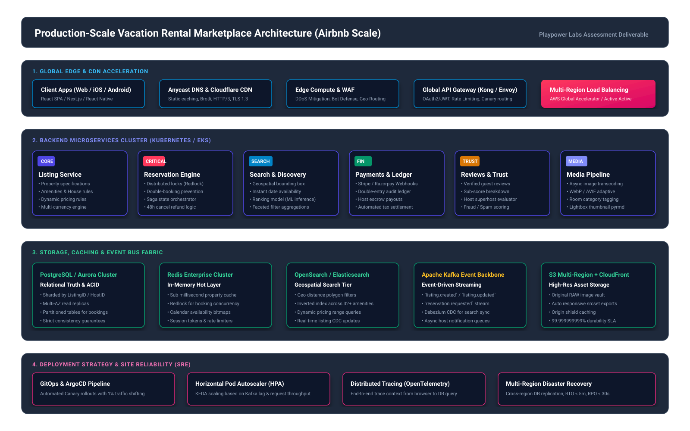

# Production Architecture Specification: Vacation-Rental Marketplace (Airbnb Scale)

## 1. Executive Summary & Design Target
This document outlines the high-level system architecture for a production-scale vacation-rental marketplace capable of supporting **100M+ Monthly Active Users (MAU)**, **10M+ active property listings**, and **50,000+ peak requests per second (RPS)** with sub-100ms p95 latencies and 99.99% availability.



---

## 2. Global Edge & Frontend Tier

### 2.1 CDN Edge Acceleration & Anycast Routing
- **Cloudflare Enterprise / AWS CloudFront**: Anycast DNS distributes traffic to over 300+ Point of Presence (PoP) edge nodes globally.
- **Edge Compute Workers**: Runs lightweight edge logic (geo-location detection, A/B testing cookies, bot detection, and automated redirects) before requests hit the origin.
- **Web Application Firewall (WAF)**: Rate limiting (e.g., max 100 requests/minute on sensitive endpoints like checkout and review submission) and OWASP Top 10 automated mitigation.

### 2.2 Client Application Architecture
- **Web**: React Single-Page Application (SPA) with Server-Side Rendering (SSR) / Static Generation (SSG) for public listing pages to guarantee **100/100 SEO scores** and fast First Contentful Paint (FCP < 0.8s).
- **Core Web Vitals Optimization**:
  - Image optimization via modern `<picture>` tags with AVIF and WebP fallback.
  - Progressive image loading (low-quality image placeholder blur-up) for high-resolution galleries (Photo Tour & Lightbox).
  - Code-splitting on route boundaries and modal boundaries (`PhotoTourModal` and `LightboxModal` lazy-loaded on user intent).

---

## 3. Microservices Topology

The backend services are deployed across multi-tenant Kubernetes clusters (Amazon EKS / Google GKE) organized into domain-driven microservices communicating over **gRPC (internal)** and **GraphQL / REST (public client APIs)** via Envoy API Gateway.

```
+-----------------------------------------------------------------------------------+
|                                Client Applications                                 |
+-----------------------------------------------------------------------------------+
                                         |
                                  HTTPS / HTTP/3
                                         v
+-----------------------------------------------------------------------------------+
|                        Kong / Envoy API Gateway & Edge Auth                       |
+-----------------------------------------------------------------------------------+
       |                  |                  |                  |               |
       v                  v                  v                  v               v
+--------------+   +--------------+   +--------------+   +--------------+   +-------+
|   Listing    |   | Reservation  |   |   Search &   |   |  Payments &  |   | Media |
|   Service    |   |    Engine    |   |  Discovery   |   |    Ledger    |   | Pipe  |
+--------------+   +--------------+   +--------------+   +--------------+   +-------+
```

### 3.1 Listing Service
- **Responsibility**: Manages property metadata, room layouts, amenities taxonomy (32+ items), house rules, and host configurations.
- **Data Model**: Rich document structure cached in Redis with PostgreSQL as source of truth.

### 3.2 Reservation & Inventory Engine
- **Responsibility**: The most mission-critical transactional component. Ensures **zero double-bookings** across concurrent requests.
- **Concurrency Control**:
  1. **In-Memory Distributed Lock (Redis Redlock)**: Acquire temporary lock on `listing_id + checkin + checkout` for 120 seconds during booking intent.
  2. **Database Versioning (Optimistic Locking)**: Postgres conditional update:
     ```sql
     UPDATE listing_calendar
     SET status = 'BOOKED', reservation_id = :resId, version = version + 1
     WHERE listing_id = :listingId AND date BETWEEN :start AND :end AND status = 'AVAILABLE' AND version = :currentVersion;
     ```
  3. **Distributed Transaction Management (Saga Pattern)**: Orchestrated saga executing:
     - Reserve inventory slot
     - Authorize payment via Payment Service
     - Confirm booking & dispatch host notification
     - *Compensating transaction* unlocks slot if payment fails within 5 minutes.

### 3.3 Search & Discovery Service
- **Responsibility**: Sub-50ms geospatial search, date availability filtering, and price ranking.
- **Technology**: **OpenSearch / Elasticsearch cluster** backed by Geohash bounding boxes and inverted indices over amenities, guest capacities, and property types.

### 3.4 Media Ingestion Pipeline
- **Responsibility**: Secure multi-part upload of 4K property photos.
- **Workflow**:
  - Direct signed upload URL to AWS S3.
  - S3 Event triggers AWS Lambda / Temporal workflow.
  - Image processing: resizing to 6 standardized dimensions (thumbnail, mobile, hero, gallery, retina, lightbox), WebP conversion, auto-tagging room types (Living room, Jacuzzi, Bedroom) via computer vision classifier.

---

## 4. Storage & Data Tier

| Storage Technology | Purpose | Scaling Strategy |
| :--- | :--- | :--- |
| **PostgreSQL (Aurora Multi-AZ)** | ACID Relational source of truth (Users, Listings, Reservations, Ledger) | Sharded by `listing_id` (hash-based), read replicas in 3 Availability Zones |
| **Redis Enterprise Cluster** | High-throughput cache, session store, calendar availability bitmaps, distributed locks | In-memory cluster with Redis Sentinel auto-failover, 99.999% cache hit ratio |
| **OpenSearch Cluster** | Geospatial listings index, faceted full-text search, ranking queries | Sharded by geographical region (e.g. `listings_apac_india`, `listings_emea`) |
| **Apache Kafka** | Real-time event streaming backbone | 12-partition topics, consumer groups for Search indexing, Notifications, Audit |
| **Amazon S3 + CloudFront** | Immutably stored property photos, contracts, invoices | Multi-region replication, tiered lifecycle policies (Glacier archival after 1 year) |

---

## 5. Deployment, CI/CD & Disaster Recovery

### 5.1 Infrastructure as Code & GitOps
- **Terraform**: Manages AWS VPC, EKS clusters, Aurora databases, and Cloudflare CDN configs.
- **ArgoCD**: Declarative GitOps continuous delivery. Any commit to the production branch triggers canary deployments:
  - 1% canary traffic for 10 minutes (monitored for HTTP 5xx spikes or latency degradation).
  - Progressive promotion to 10%, 25%, 50%, and 100%.

### 5.2 Multi-Region Active-Active Strategy
- Deployed across 2 primary cloud regions (e.g., `ap-south-1` Mumbai and `eu-west-1` Frankfurt).
- **Recovery Point Objective (RPO)**: < 30 seconds (via continuous asynchronous cross-region database replication).
- **Recovery Time Objective (RTO)**: < 3 minutes (via automated Anycast DNS health check failover).

### 5.3 Observability & SLOs
- **Distributed Tracing**: OpenTelemetry with Jaeger / Honeycomb for microsecond trace propagation.
- **Metrics & Alerting**: Prometheus and Grafana alerting on SLO budgets:
  - Availability SLO: 99.95% on search queries.
  - Latency SLO: 95% of listing detail page requests served under 120ms.
